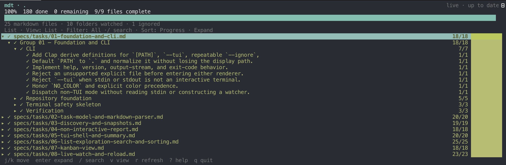

# mdt

[](https://github.com/markwylde/markdown-tasks/actions/workflows/ci.yml)
[](LICENSE)

`mdt` turns Markdown checkboxes into a fast command-line report or a live,
searchable terminal task explorer.

Markdown stays the source of truth. Version 0.1 is deliberately read-only: the
interface never changes a checkbox or writes to a source file.



## Highlights

- Recursively discovers Markdown task files with deterministic natural sorting.
- Prints a clean, pipe-friendly report by default.
- Provides responsive List and three-column Kanban terminal views with search,
  filters, sorting, grouping, and collapse controls.
- Watches for create, edit, rename, and delete events without blocking input.
- Preserves the last good snapshot when a refresh fails.
- Ships as one native Rust binary for macOS, Linux, and Windows.

## Install

Build from a checkout with Rust 1.88 or newer:

```sh
cargo install --path .
```

Or install directly from GitHub:

```sh
cargo install --git https://github.com/markwylde/markdown-tasks.git
```

Release archives, when published, contain a single `mdt` (`mdt.exe` on Windows)
binary and a checksum.

## Use

Print a deterministic report and exit:

```sh
mdt specs/tasks
mdt README.md
mdt --color never specs/tasks > task-report.txt
```

Open the full-screen explorer with live reload:

```sh
mdt --tui specs/tasks
```

The path may be a Markdown file or directory and defaults to the current
directory. Directory scans recognize `.md`, `.markdown`, `.mdown`, and `.mkd`
case-insensitively.

Run `mdt --help` for the compact, authoritative option reference.

## Markdown syntax

Bullet and ordered tasks are supported beneath ATX headings:

```markdown
# Project

## Foundation

- [x] Create the crate
- [ ] Add the terminal UI
  - [ ] Test narrow terminals
1. [X] Ordered tasks work too
```

Checkbox-looking lines inside fenced code blocks are ignored. Heading hierarchy
forms explorable sections; task indentation is preserved.

## TUI keys

| Key | Action |
| --- | --- |
| `q`, `Ctrl-C` | Quit |
| `j`/`k`, arrows | Move selection |
| `PageDown`/`PageUp`, `Ctrl-D`/`Ctrl-U` | Move by a page |
| `g`/`G`, Home/End | First/last item |
| Enter, Space, Right/Left | Expand or collapse |
| `z` | Collapse or expand all |
| `/` | Search |
| `1`/`2`/`3` | All, remaining, or done |
| `v` | List/Kanban |
| `s` | Progress/name sort |
| `f` | Group Kanban by file |
| `r` | Refresh now |
| `?` | Help |

Search matches paths, heading ancestry, and task labels. List filters retain the
real progress totals for each file and section.

Version 0.1 is intentionally keyboard-first; mouse input is left disabled until
its behavior is reliable across the supported terminals.

## Discovery and ignores

Recursive scans skip symlinked directories and these generated/source-control
directories by default:

```text
.git .hg .svn node_modules bower_components dist build out .next .nuxt
.cache coverage target vendor .venv venv __pycache__
```

Add ignores with repeated `--ignore NAME` or `--ignore relative/path`. Use
`--no-default-ignore` to disable only the built-in list.

## Live reload

Interactive mode watches the selected target and debounces bursts of create,
modify, delete, and rename events. A failed refresh leaves the last good snapshot
on screen; press `r` to retry.

Native filesystem events can be unreliable on some network mounts and when a
Linux environment watches files hosted by another operating system. Manual
refresh remains available in those cases.

## Exit status and pipelines

Successful scans exit `0`, including empty reports and an early downstream pipe
closure such as `mdt specs/tasks | head`. Runtime failures exit `1`; this
includes unreadable targets and stdout errors other than a closed pipe. Invalid
arguments, unsupported explicit file extensions, and `--tui` without a terminal
exit `2`. Fatal diagnostics are written to stderr.

## Development

```sh
cargo fmt --check
cargo clippy --all-targets --all-features -- -D warnings
cargo test --all-targets --all-features
cargo deny check
```

See [CONTRIBUTING.md](CONTRIBUTING.md) for fixture and snapshot guidance. The
repository also keeps the
[large-fixture performance baseline](docs/performance.md), an
[ANSI terminal interaction recording](docs/mdt-demo.ansi.gz), and the
[expected report for the project task specs](docs/specs-task-report.txt).
